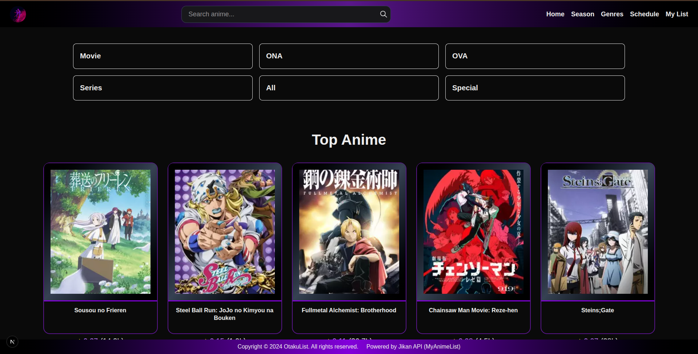
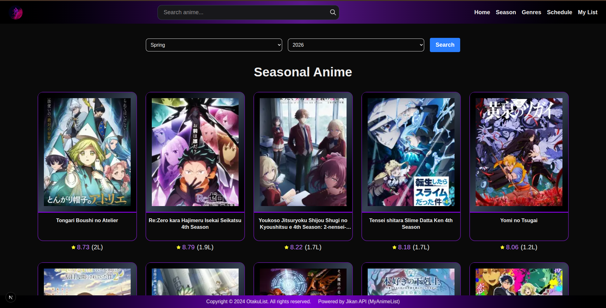
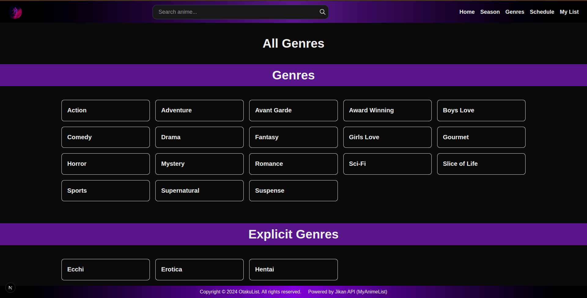
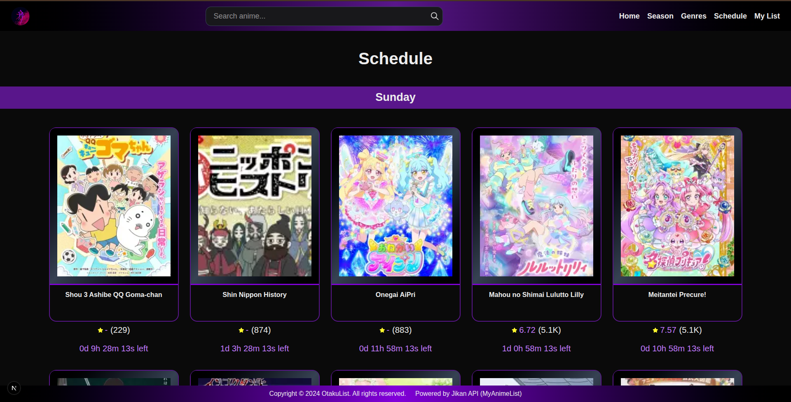
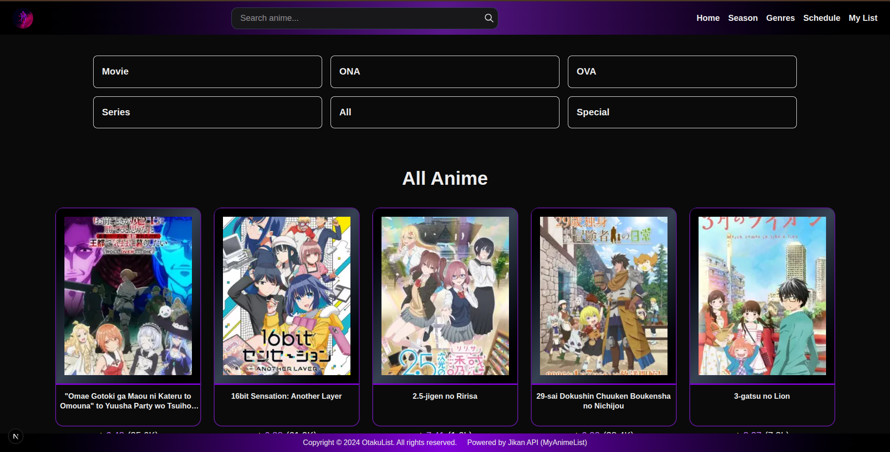
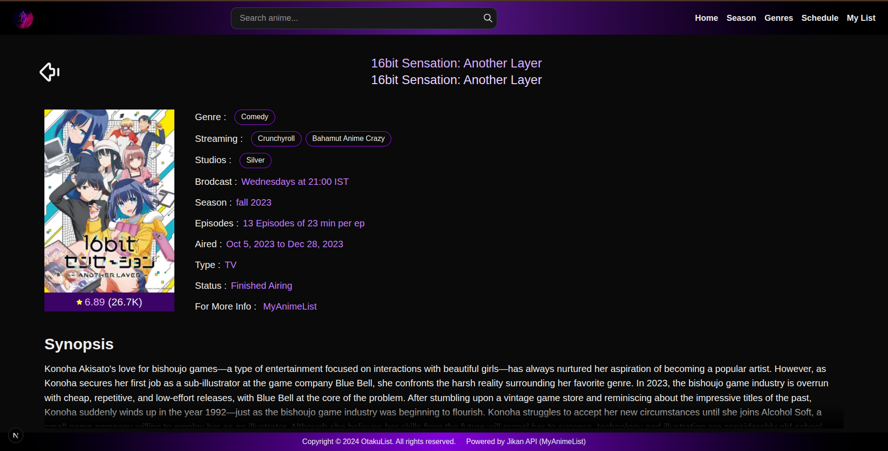
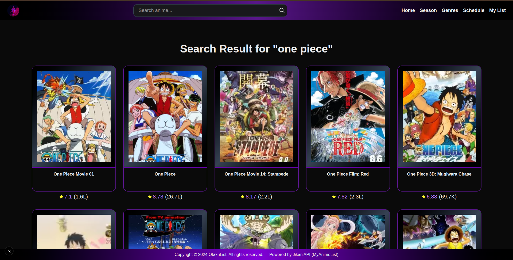
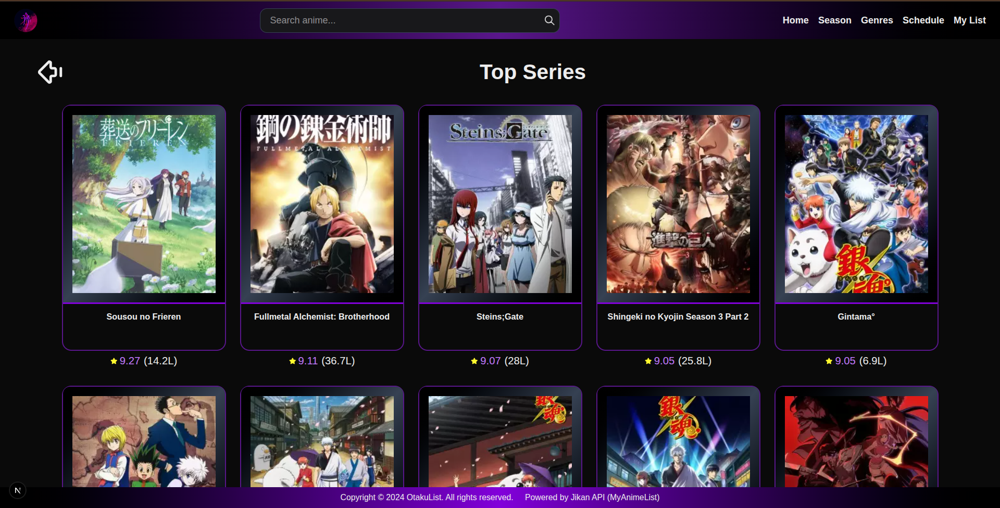

# 🎌 Otaku List

[](https://av-otaku-list.vercel.app)


A modern anime discovery platform built with **Next.js** and **Tailwind CSS**, powered by the **Jikan API** — optimized specifically for **Indian users** 🇮🇳.

Otaku List provides curated anime browsing with smart caching, debounced search, backend filtering, and schedules aligned to **Indian Standard Time (IST)**.


---

## ✨ Features

- 🏠 Home dashboard with trending anime
- 📅 Anime schedules aligned to **Indian time (IST)**
- 🌸 Seasonal anime browsing
- 🔝 Top anime rankings
- ❤️ My Own curated list of animes under **My List**
- 🎭 Genre-based anime filtering
- 🔍 Debounced anime search
- ⚡ Smart caching for faster performance
- 🚦 App-level rate limiting
- 🇮🇳 Backend-filtered data optimized for Indian viewers
- 📱 Fully responsive UI

---

## 🇮🇳 Built for Indian Anime Fans

Most anime platforms show schedules in Japanese or global time zones.

Otaku List:

- Converts schedules to **Indian Standard Time**
- Filters backend data for **Indian-friendly viewing**
- Reduces unnecessary metadata
- Focuses on practical watchability

This makes it easier for Indian users to know *exactly when anime airs*.

---

## 📸 Screenshot












---

## 🛠 Tech Stack

<p align="left">


</p>

**Core Architecture**

- Next.js (App Router)
- React
- Tailwind CSS
- Jikan API
- Server-side caching
- Custom debouncing logic
- Backend filtering layer
- App-level rate limiting
- Vercel deployment

---

## 🧠 Performance & Architecture

Otaku List is designed to protect API limits and ensure smooth UX:

- **Debouncing** → prevents spam search requests
- **Caching** → reduces repeated API calls
- **Rate limiting** → protects Jikan API
- **Backend filtering** → lighter payloads
- **Time-zone normalization** → IST schedules

---

## 🚀 Getting Started

### Clone the repo

```bash
git clone https://github.com/anirudh7065/otaku-list.git
cd otaku-list
```

## Environment Variables

Create a `.env.local` file:
\```
BASE_URL=<https://api.jikan.moe/v4>
\```

### Install dependencies

```bash
npm install
```

### Run development server

```bash
npm run dev
```

Open:

```
http://localhost:3000
```

---

## 📂 Project Structure

```
.
├── app
│   ├── anime
│   │   └── [id]
│   │       └── page.tsx
│   ├── api
│   │   ├── fetchGenresByID
│   │   │   └── route.ts
│   │   ├── fetchMyAnime
│   │   │   ├── anime_data.json
│   │   │   └── route.ts
│   │   ├── fetchOneAnime
│   │   │   └── route.ts
│   │   ├── fetchSchedule
│   │   │   └── route.ts
│   │   ├── fetchSearch
│   │   │   └── route.ts
│   │   ├── fetchSeasonalAnime
│   │   │   └── route.ts
│   │   ├── fetchTopAnime
│   │   │   └── route.ts
│   │   └── log
│   │       └── route.ts
│   ├── error.tsx
│   ├── favicon.ico
│   ├── genres
│   │   ├── genres.json
│   │   ├── [id]
│   │   │   └── page.tsx
│   │   └── page.tsx
│   ├── globals.css
│   ├── layout.tsx
│   ├── mylist
│   │   ├── page.tsx
│   │   └── [type]
│   │       └── page.tsx
│   ├── not-found.tsx
│   ├── page.tsx
│   ├── schedules
│   │   └── page.tsx
│   ├── search
│   │   └── page.tsx
│   ├── season
│   │   └── page.tsx
│   └── top
│       ├── not-found.tsx
│       └── [type]
│           └── page.tsx
├── clean.txt
├── components
│   ├── AnimeList
│   │   ├── AnimeContent.tsx
│   │   ├── AnimeCountDown.tsx
│   │   ├── AnimeListItems.tsx
│   │   ├── AnimeSearchDesktopWrapper.tsx
│   │   ├── AnimeSearchMobileWrapper.tsx
│   │   └── AnimeSearch.tsx
│   ├── Footer
│   │   └── Footer.tsx
│   ├── Loaders
│   │   ├── AnimeListLoader.tsx
│   │   ├── AnimeLoading.tsx
│   │   ├── AnimeScheduleLoader.tsx
│   │   ├── AnimeSearchLoader.tsx
│   │   └── Loader.tsx
│   ├── MyListComponent.tsx
│   ├── Navbar
│   │   ├── MobileNav.tsx
│   │   └── Navbar.tsx
│   └── ScrollToTop.tsx
├── constants
│   ├── genresData.json
│   └── japaneseToIndianTime.ts
├── context
│   └── SearchToggleContext.tsx
├── eslint.config.mjs
├── hooks
│   ├── useCountdown.ts
│   ├── useGetData.ts
│   └── usePageQuery.ts
├── lib
│   ├── clientLogger.ts
│   ├── rateLimiter.ts
│   └── withApiProtectionLogger.ts
├── LICENSE
├── next.config.ts
├── next-env.d.ts
├── package.json
├── package-lock.json
├── postcss.config.mjs
├── proxy.ts
├── public
│   ├── loading-circle.svg
│   ├── logo
│   │   └── logo-circle.png
│   └── screenshots
│       ├── app-preview1.png
│       ├── app-preview2.png
│       ├── app-preview3.png
│       ├── app-preview4.png
│       ├── app-preview5.png
│       ├── app-preview6.png
│       └── app-preview7.png
├── README.md
├── tsconfig.json
└── types
    ├── genreType.ts
    └── newPost.ts


```

---

## 🤝 Contribution Guidelines

Contributions are welcome!

1. Fork the repository
2. Create a feature branch

```bash
git checkout -b feature/amazing-feature
```

3. Commit changes

```bash
git commit -m "Add amazing feature"
```

4. Push

```bash
git push origin feature/amazing-feature
```

5. Open a Pull Request

### Rules

- Keep components reusable
- Follow existing structure
- Use TypeScript types
- No breaking UI without discussion
- Write clean, readable code

---

## 📜 License

This project is licensed under the MIT License.

```
MIT License

Copyright (c) 2026

Permission is hereby granted, free of charge...
```


---

## 🙌 Acknowledgements

Powered by [jikan-rest](https://github.com/jikan-me/jikan-rest) — thanks to @jikan-me  
Anime data from https://jikan.moe  
Data sourced from MyAnimeList  
Built with ❤️ using Next.js

---

## ⭐ Support

If you like this project:

⭐ Star the repo  
🍴 Fork it  
📢 Share it  

---

**Made by Otaku, for Otaku 🎌**
